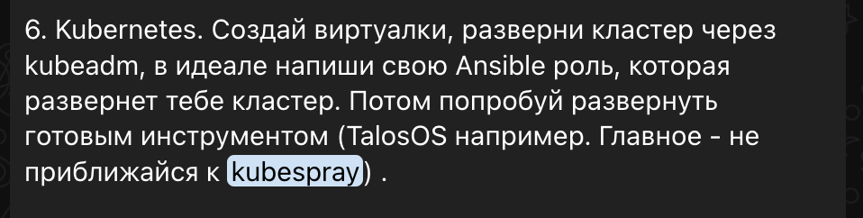

# Установка kubespray

## kubespray

[documentation](https://github.com/kubernetes-sigs/kubespray)

## ansible

[install ansible first ](https://github.com/kubernetes-sigs/kubespray/blob/master/docs/ansible/ansible.md#installing-ansible)

Дополнительно пришлось установить python3.12

```shell
sudo yum install python3.12 -y
sudo yum install libffi-devel
sudo ldconfig
```


```shell
sudo dnf update
sudo dnf upgrade
sudo yum install wget
yum install gcc yum-utils zlib-devel python-tools cmake git pkgconfig -y --skip-broken
yum groupinstall -y "Development Tools" --skip-broken
cd /usr/src
wget https://www.python.org/ftp/python/3.12.3/Python-3.12.3.tgz # меняем тут версию питона
tar xzf Python-3.12.3.tgz # и тут тоже

./configure # если установка новая - то выбираем этот вариант

./configure --enable-optimizations # если нужно обновить версию - этот

make
make install # устанваливаем с нуля

make altinstall # устанавливаем новую версию рядом с системной, а не пытаемся ее заменить
```
## Бонус

