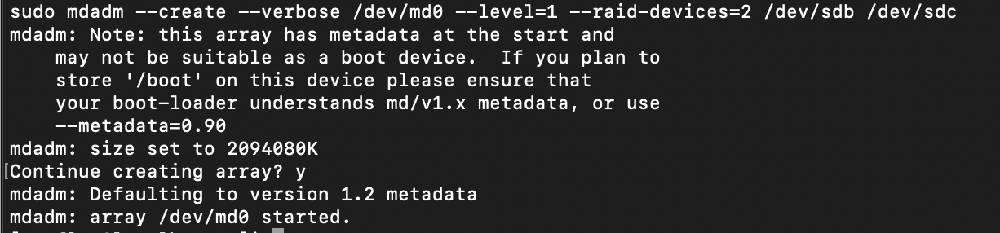
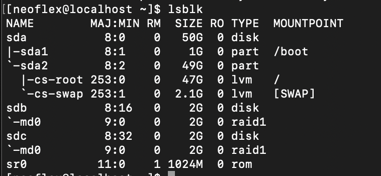
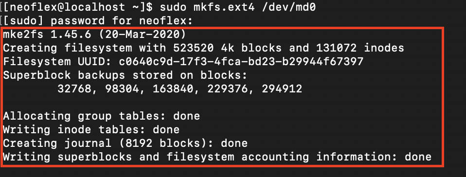
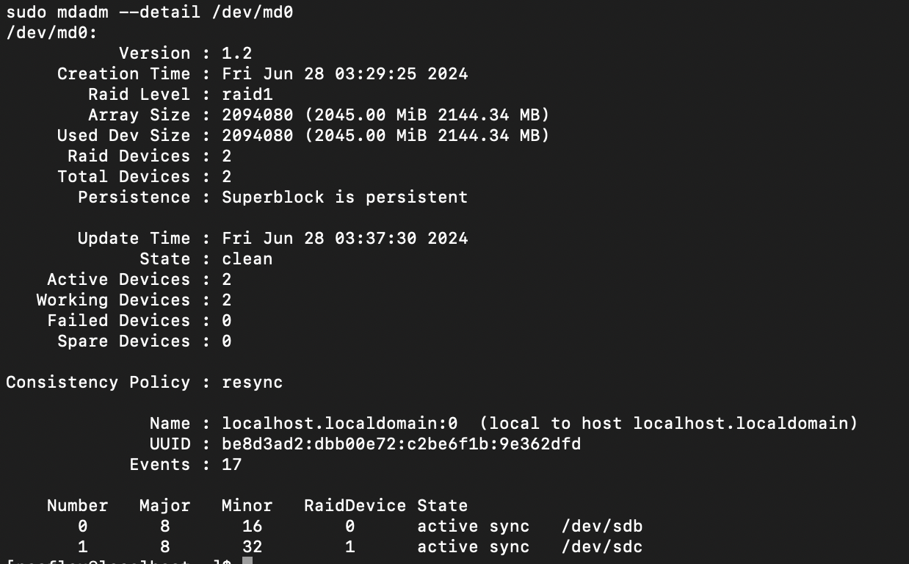
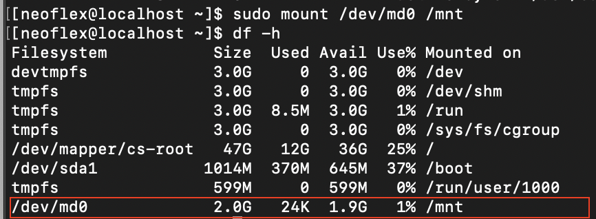

# RAID

##  Подключаем два дополнительных жестких диска к нашей виртуальной машине

Настройки - носители - контроллеры SATA.  Жмем кнопку "Добавить"

Создаем два диска по 2 Гб, для примера

## Создаем RAID

Для подключения RAID-массива мы будем использовать программу mdadm

`dnf install mdadm -y`

`mdadm --create --verbose /dev/md0 --level=1 --raid- devices=2 /dev/sdb /dev/sdc`

- `/dev/md0` - как будет отображаться в системе новый raid-массив;
- `--level=1` - это тип массива, в нашем случае RAID1;
- `--raid-devices=2` - количество дисков, которое добавляется в массив.

Вывод этой команды вот такой:

Проверяем успешность создания 

`lsblk`

## Создаем файловую систему ext4 на новом массиве

`mkfs.ext4 /dev/md0`

Проверяем, что массив собрался корректно:

`$ mdadm --detail /dev/md0`

## Монтируем устройство к папке

`mount /dev/md0 /mnt`

`df -h`

Массив примонтировался без ошибок. Чтобы не делать этого каждый раз вручную вносим изменения в файл fstab:

`nano /etc/fstab`

либо указываем «/dev/md0», либо UUID устройства (можно узнать командой «blkid /dev/md0»). Первый вариант проще, поэтому пишем в файл:

`/dev/md0   /mnt   ext4   defaults   0   1`

Второй вариант выглядел бы так:

`UUID=30ab3479-50d5-4420-bb08-41e4706d787d      /mnt     ext4
defaults   0   0`

Перед проверкой      автоматического       монтирования           при      старте            нужно размонтировать нашу директорию /mnt командой:

`$ umount /mnt`

Перезагружаемся

После перезагрузки можно снова проверить состояние RAID массива

`$ mdadm --detail /dev/md0`