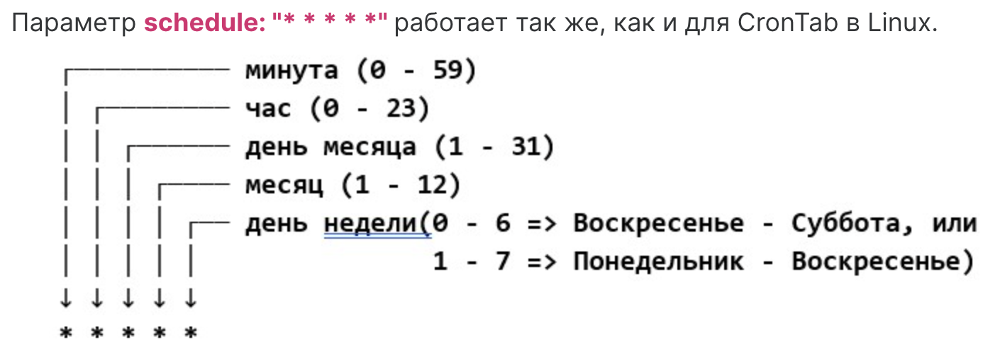

# CronJob

Задачи предоставляют удобные механизмы для запуска конечных по времени рабочих нагрузок. Именно такие нагрузки часто требуется запускать по какому- либо расписанию, например, процесс бэкапирования по ночам или удаление старых джобов раз в день. Для этого в Kubernetes существует дополнительный контроллер репликации CronJob, который фактически является абстракцией более высокого уровня над Job. 

```yaml
apiVersion: batch/v1
kind: CronJob
metadata:
  name: batch-job-every-minute
spec:
  schedule: "* * * * *"
  jobTemplate:
    spec:
      template:
        metadata:
          labels:
            app: periodic-batch-job
        spec:
          restartPolicy: OnFailure
          containers:
          - name: main
            image: perl:5.34.0
            command: ["perl", "-Mbignum=bpi", "-wle", "print bpi(2000)"]
```

`kubectl get cronjob`

`batch-job-every-minute   * * * * *   <none>     False     0        <none>          19s`

`shedule` работает также как и crontab и Linux



Одним из преимуществ использования CronJob является то, что описанная нами задача хранится в Kubernetes в виде шаблона и в любой момент может быть запущена, в том числе и вручную. Многие визуальные средства предоставляют функционал запуска джобов из шаблона CronJob. Аналогичный функционал предоставляет и kubectl. Продемонстрируем это, запустив задание из созданного CronJob вручную. (Это одна длинна команда. Можно целиком скопировать её в консоль.)

`kubectl create job --from=cronjob/batch-job-every-minute batch-job-every-minute-manual-001`

`job.batch/batch-job-every-minute-manual-001 created`


Теперь можем посмотреть на созданные поды

`kubectl get po`

```shell
batch-job-every-minute-28658802-fxrs8     0/1     Completed          0               2m2s
batch-job-every-minute-28658803-lpqbx     0/1     Completed          0               62s
batch-job-every-minute-28658804-gd88w     1/1     Running            0               2s```