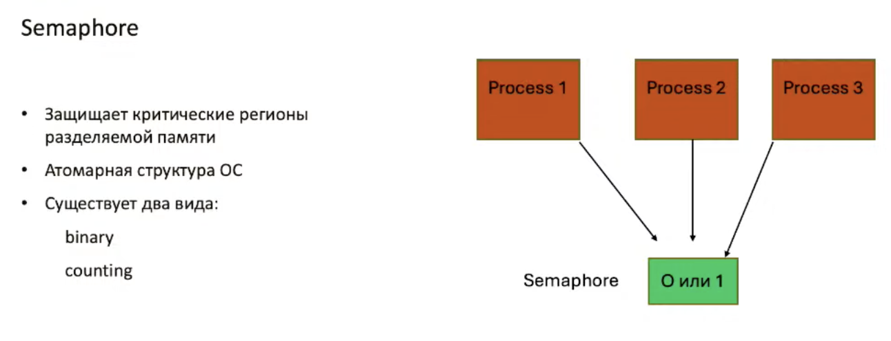
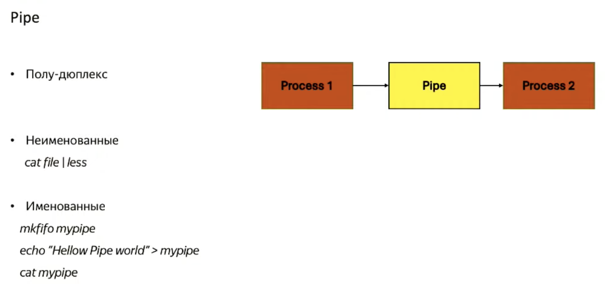
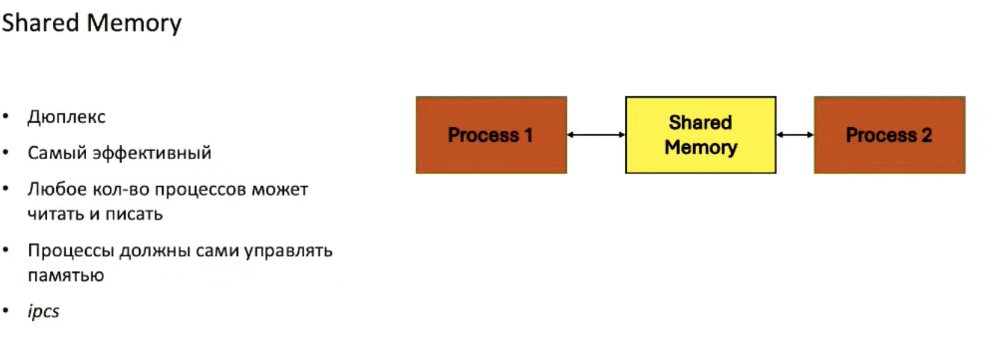
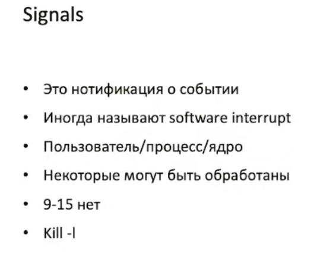
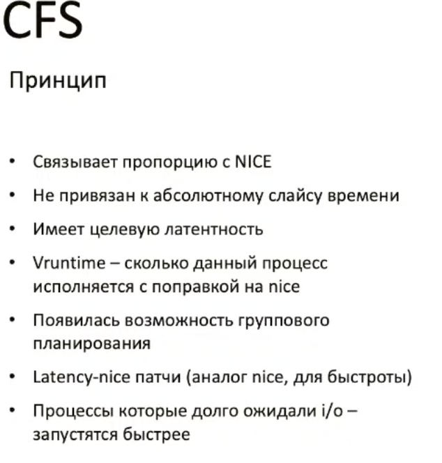
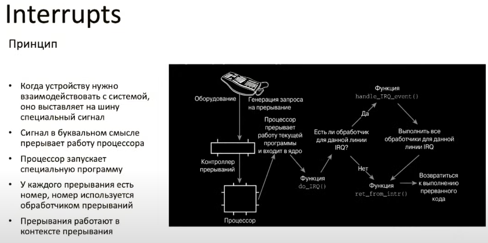
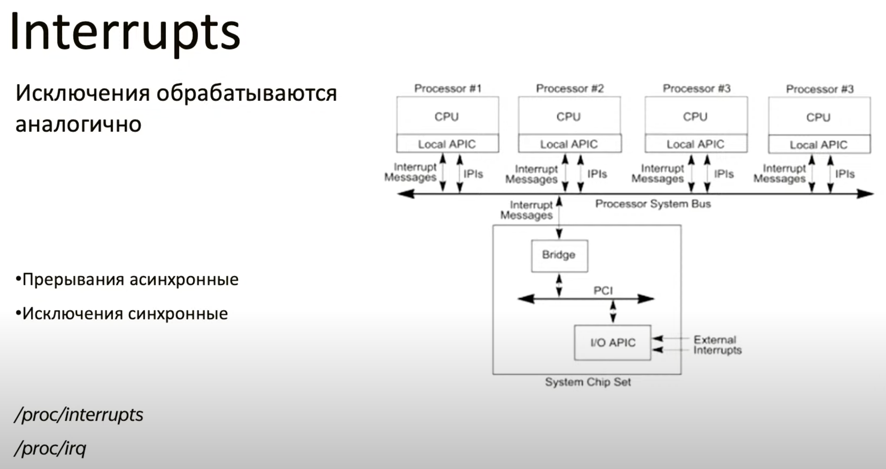
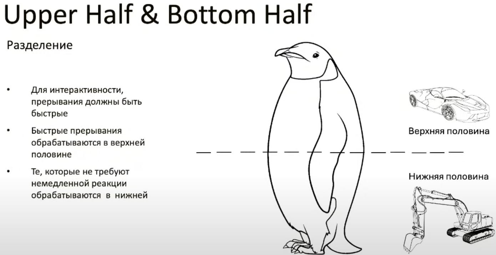
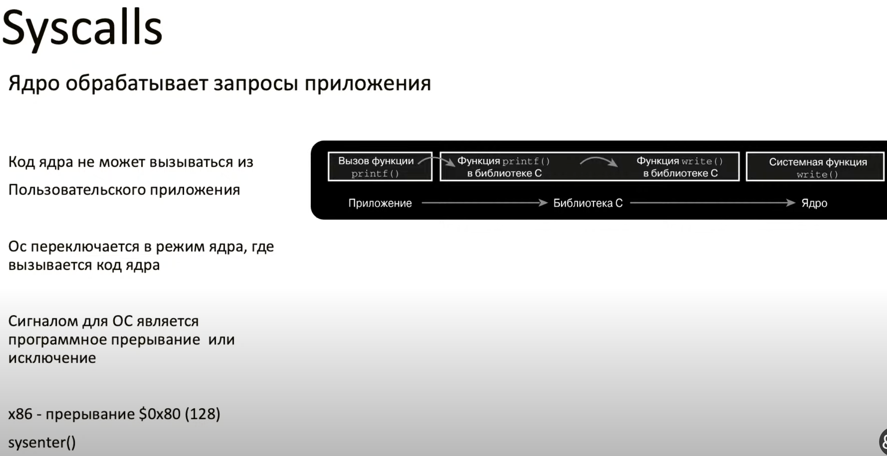
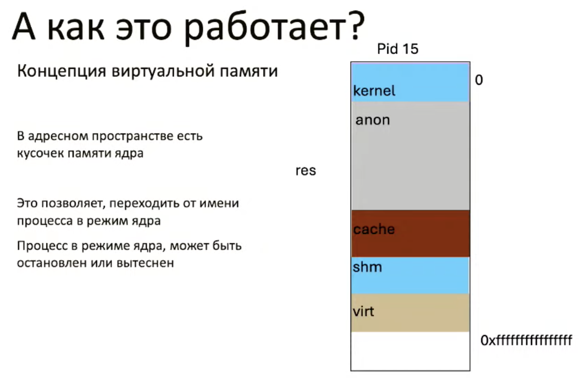

# Внутренности Linux

[Видео](https://www.youtube.com/watch?v=kJG2V48L-IE)

## Процессы

Процессы - абстракция, которая имеет свою область памяти

## Межпроцессное взаимодействие

- семафоры

- сокеты

- каналы(pipe). бывают именованные и неименованные

`mkfifo`

- общая память

- файлы

- сигналы

Есть команда `ipcs`, которая показывает семафоры, разделяемую память

## Состояния процессов

- R running

- S sleep

- T stopped

- D uninterruptible sleep

- Z zombie

- X terminated

## Планировщик

 Отвечает за правильное распределение процессорного времени между процессами

### Типы задач

- IO bound

- CPU bound

### Приоритеты задач

- realtime

`0-99` - realtime

Выше значение - выше приоритет

- normal

`100-139` - not realtime

Ниже значение - выше приритет

### Планировщики 

- FIFO

- Round robin

- Sched_normal

- O(1)

- CFS

- red-black tree

- EECDV (Earliest eligible virtual deadline first)

## Прерывания

Оборудование обращается к процессору с просьбой выделить ресурсы для выполнения каких-то действий

## системные вызовы

Это API к ядру Линукса

