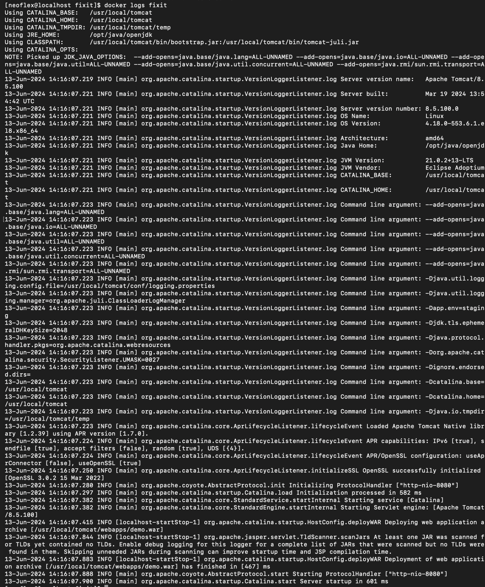
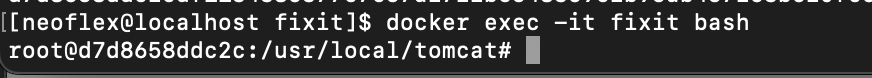
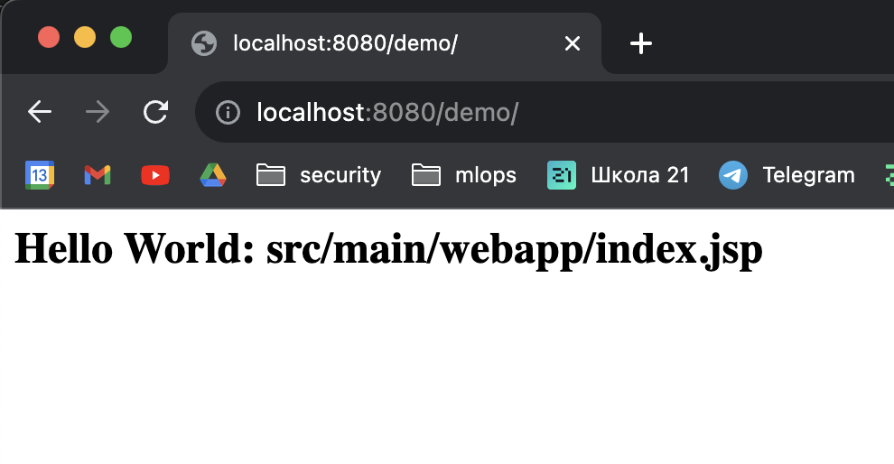
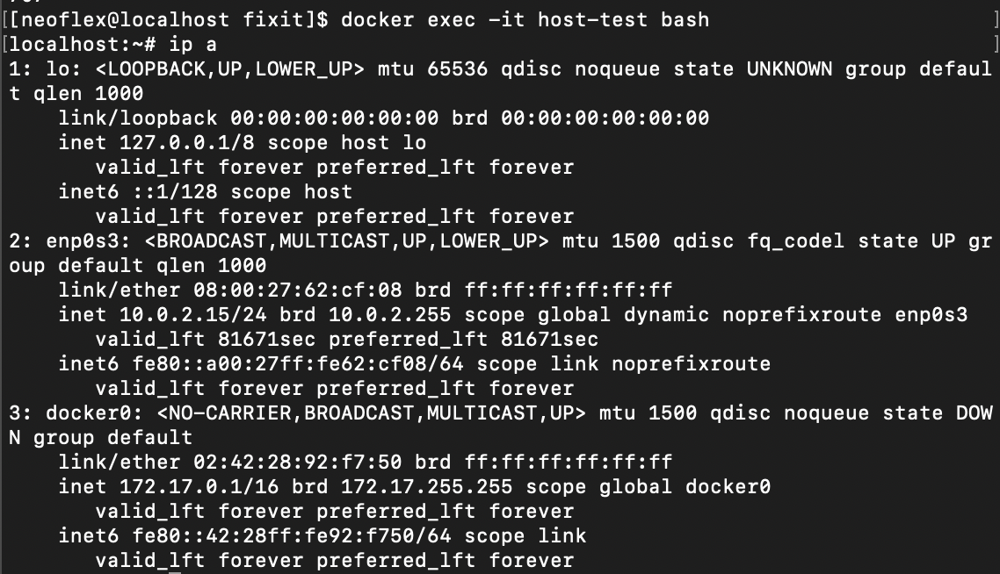
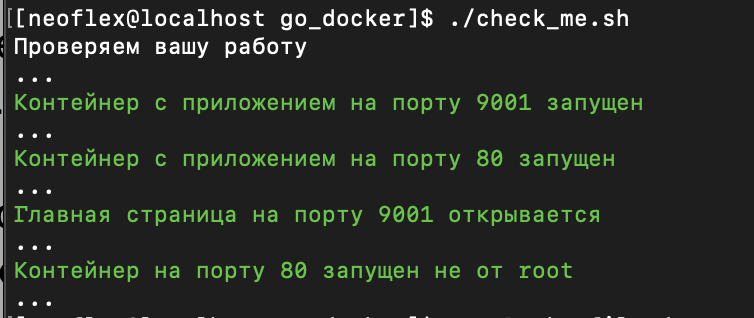

# Проектное задание по разделу docker

## Задание 1. Чиним докерфайл

- Текст исправленного Dockerfile находится в этой папке

- Скрин логов запущенного контейнера:

- Скрин вывода из контейнера, запущенного в интерактивном режиме.

- Скрин из UI web-приложения

## Задание 2. Запускаем базу данных

[документация по tmpfs](https://docs.docker.com/storage/tmpfs/)

использованная для запуска команда:

`docker run --name postgres2 --mount type=tmpfs,destination=/var/lib/postgresql/data,tmpfs-size=512MB -d -e POSTGRES_PASSWORD=postgres postgres:13`

## Задание 3. Пробуем Host network

[документация для запуска контейнера с типом сети host ](https://docs.docker.com/network/drivers/host/)

`docker run -it --net=host --name host-test nicolaka/netshoot nc -lkv 0.0.0.0 8000`

после этого запускаем терминал внутри этого контейнера:

`docker exec -it host-test bash`

Видим в приглашении ко вводу в командной строке изменения и понимаем что мы уже внутри

Смотрим вывод команды `ip a`

## Задание 4. Контейнеризируем приложение на Go

- Тексты докерфайлов находятся в папке go_docker

- Скриншот вывода после запуска скрипта check_me.sh

- Команду, с помощью которой вы запустили Dockerfile_dev, примонтировав
папку с хоста

`docker run -p 9001:9001 -v $(pwd):/src/mypackage/myapp/ -d dev`
