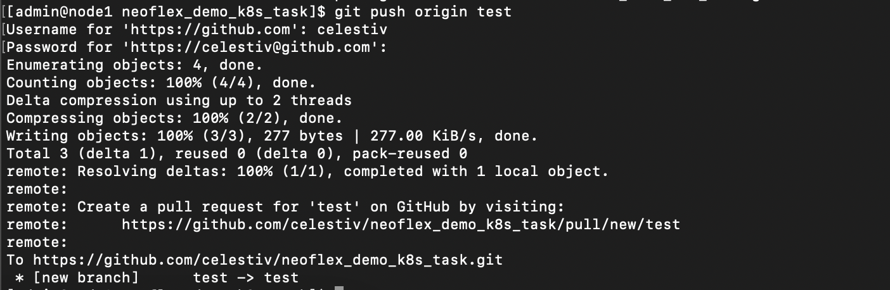
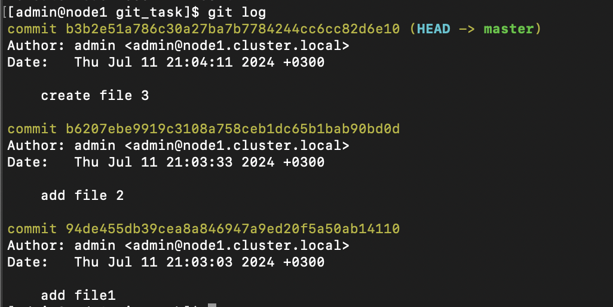
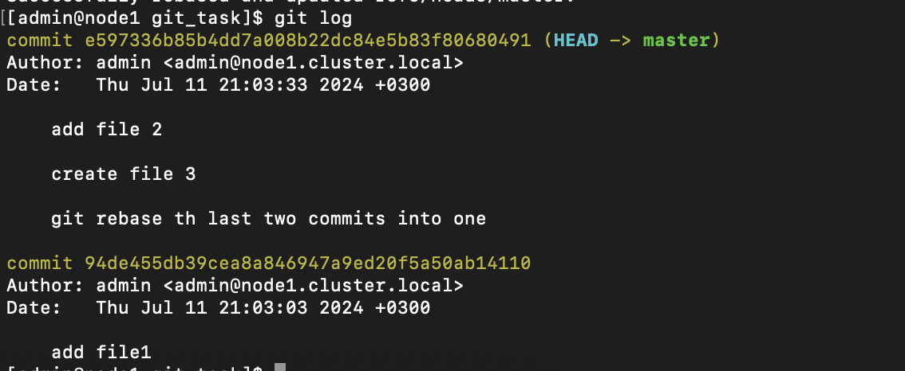

# Проектное задание по разделу Git
 
## Задание 1. Работа с GitHub

 Это простое задание. В нём нужно только сделать коммит в репозиторий. Только нужно аутентифицироваться с токеном.
1. Создать репозиторий на GitHub.com или использовать существующий.
2. Создать токен для доступа в этот репозиторий или в свой аккаунт целиком. 3. Клонировать этот репозиторий на свою виртуальную машину Infra.
4. Из командной строки:
- создать новую ветку,
- переключиться на эту ветку,
- создать новый файл,
- закоммитить этот файл локально,
- отправить изменения в удалённый репозиторий, используя токен для
аутентификации.
В ответ прислать.
1. Скриншот, показывающий результат выполнения команды git push. На нём должно быть видно, что успешно прошла аутентификация и файлы отправлены.

## Задание 2. Работа с git rebase
В этом задании нужно будет выполнить несколько действий с Git репозиторием. 1. Инициализировать новый Git репозиторий в пустой папке.
2. Сделать три коммита в него, создавая новые файлы или изменяя их. Не
забывайте давать осмысленные комментарии к коммитам.
3. Запустить команду git log и сделать скриншот её вывода. Запомнить sha
самого старого коммита.
4. Сделать git rebase, начиная с этого самого старого коммита. Использовать
опцию squash, чтобы склеить два последних коммита. Текст комментария снова должен быть осмысленным.
5. Запустить команду git log и сделать скриншот её вывода.
В ответ прислать.
1. Скриншот вывода команды git log до выполнения git rebase
 

2. Скриншот вывода команды git log после выполнения git rebase

## Задание 3. Запускаем пайплайн GitLab

1. В этом задании по сути нужно сделать всё, чтобы описано в практической работе, вместо microk8s можно использовать minikube или kubespray. Для начал проверьте, что кластер работает при помощи команды kubectl get nodes.
2. Зарегистрируйтесь на GitLab и форкните (или импортируйте) этот проект
https://gitlab.com/neo-learn/sample-app2.git
3. Создайте токен для доступа в docker-registry на GitLab.
4. Зарегистрируйте раннера в своём кластере. Установите его через Helm. Сделайте скриншот окна, где видно, что раннер активен.
5. Создайте в Настройках CI/CD две переменные: CI_REGISTRY_PASSWORD, CI_REGISTRY_USER. Сделайте скриншот окна с переменными.
6. Доработайте пайплайн, как в практической работе.
7. Запустите пайплайн. Сделайте скриншот окна с успешно отработавшим пайплайном.
8. Проверьте, что приложение запустилось. Перейдите в его веб-интерфейс (в браузере). Сделайте скриншот сообщения, которое выдаёт приложение.
В ответ прислать.
1. Скриншот окна, где видно, что в проекте есть активный раннер.
2. Скриншот окна с переменными CI/CD.
3. Скриншот окна с успешно отработавшим пайплайном.
4. Скриншот сообщения, которое выдаёт работающее приложение в браузере.
Задание 4. Пишем свой пайплайн на GitLab
1. Зарегистрировать Gitlab Runner в кластер Kubernetes. Установить его через Helm и связать его с Вашим репозиторием на gitlab.com.
2. Написать pipeline для web-приложения из урока по Docker. В пайплайне должны быть такие стадии:
- Build. Сборка приложения в Dockerfile с помощью Kaniko, и отправка в хранилище артефактов (registry.gitlab.com или hub.docker.com)
- Deploy-on-Dev. Для деплоя попробуйте использовать Helm (у вас ведь есть чарты из задания по Helm).
3. Сделайте скриншот логов успешного пайплайна.
4. Выполните команду kubectl get all в неймспейсе gitlab или в том неймспейсе, где развернулось ваше приложение. Сделайте скриншот результата.
 Задание 3. Запускаем пайплайн GitLab
 
может подсказать, как это можно сделать (по умолчанию этот способ развернёт приложение в неймспейс gitlab):
Но сможет ли раннер использовать команды helm? Этот фрагмент пайплайна
deploy:
  stage: deploy to kubernetes
  image:
    name: alpine/helm:3.2.1
  tags:
    - microk8s
  script:
- helm upgrade <имя приложения> <путь к чартам в репозитории> --install --namespace <имя неймспейса>
В ответ прислать.
1. Ссылку на репозиторий, из которого вы запускаете пайплайн.
2. Текст пайплайна.
3. Скриншот логов успешного пайплайна.
4. Скриншот результат выполнения команды kubectl get all в неймспейсе
gitlab или в том неймспейсе, где развернулось ваше приложение.