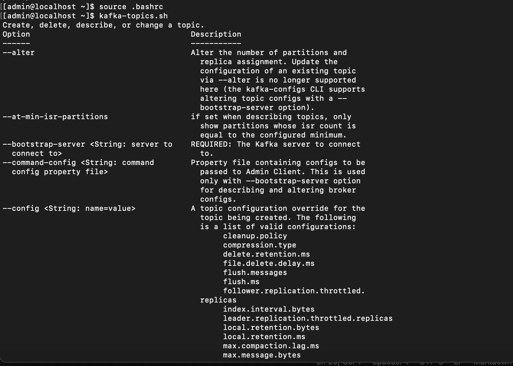
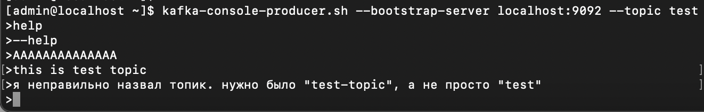
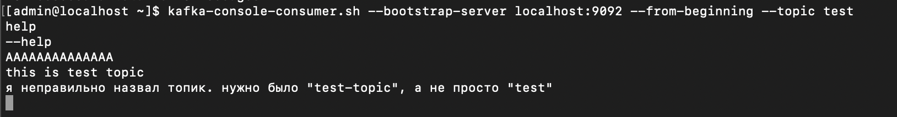

# Проектное задание по разделу Брокеры сообщений

## Задание 1. Запуск Kafka из любого места

1. Чтобы выполнить проектное задание нужно установить Kafka + ZooKeeper так, как было описано в практических работах.

2. Дальше мы будем использовать команды Kafka, например: kafka-topics, kafka- console-producer, kafka-console-consumer. Мы уже настроили запуск этих команд из любого места, когда выполняли практические работы. Но когда мы писали systemd сервисы, мы перенесли бинарные файлы Kafka. Теперь нужные нам команды не работают. Нужно исправить эту проблему.

В ответ прислать.

1. Команду (или команды), при помощи которой вы выполнили задание.

`nano ~/.bashrc`

В файде отредактировал последнюю строку, прописал там новый путь до папки с бинарниками:

`export PATH=/opt/kafka/bin:/home/admin/.local/bin:/home/admin/bin:/usr/local/bin:/usr/bin:/usr/local/sbin:/usr/sbin`

2. Скриншот, подтверждающий запуск команды kafka-topics из домашней папки пользователя.

## Задание 2. Передаём сообщения через Kafka
1. Через Kafka создайте топик test-topic
2. Запустите продюсера и отправьте три любые сообщения в топик, который только что создали. Сделайте скриншот команды, с помощью которой запустили продюсера, и отправленных сообщений.
3. Запустите консьюмера и прочтите три сообщения из топика, в который только что их отправили. Сделайте скриншот команды, с помощью которой запустили консьюмера, и принятых сообщений.

В ответ прислать.

1. Скриншот запуска продюсера и отправки сообщений через него.

2. Скриншот запуска консьюмера и получения сообщений через него.

