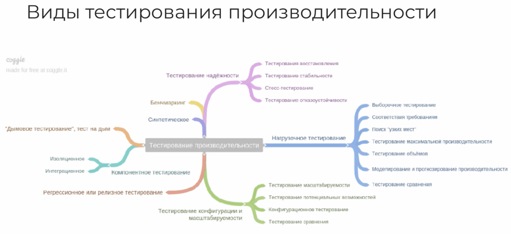
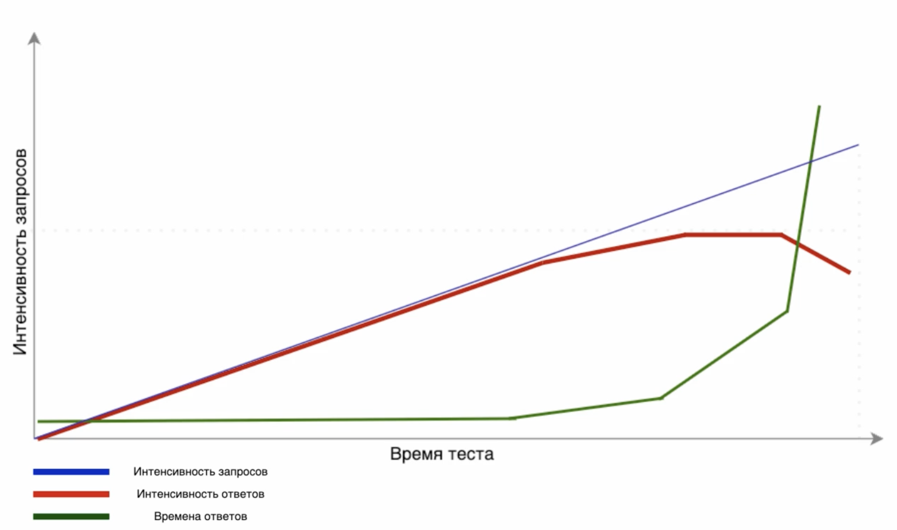
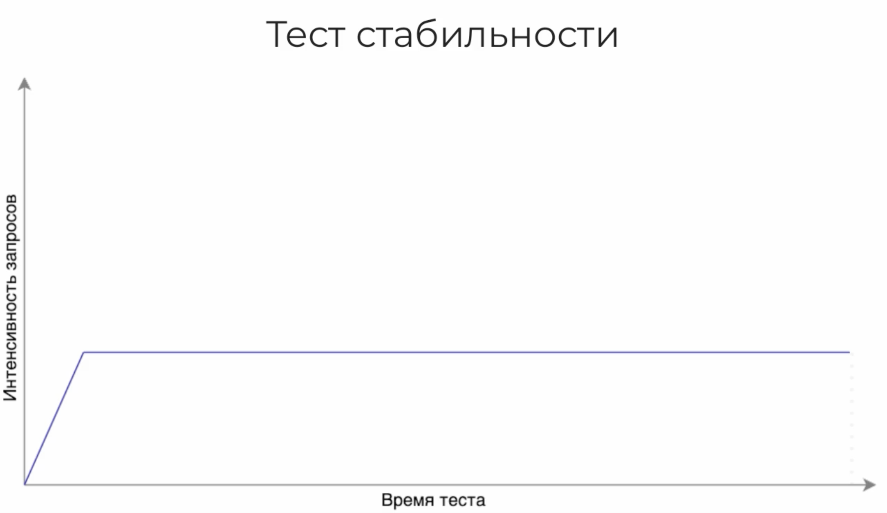
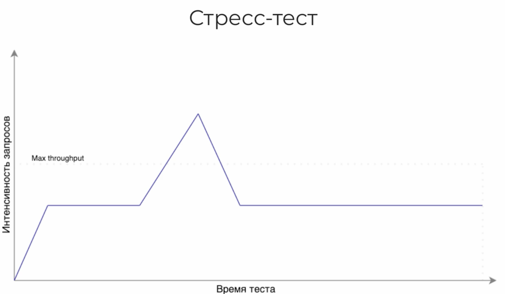

# Цели проведения тестирования производительности и виды нагрузочных тестов

## В чем измеряется производительность

### Какие характеристики важны пользователям

    - Как быстро сервер выполняет запросы

    1,5-2 часа

    - тест стабильности

    12+ часов 

    - стресс тест

## Цель тестирования и как мы ее достигаем с помощью тестов

Планирование тестирования

- цель 

- метрики

- план
