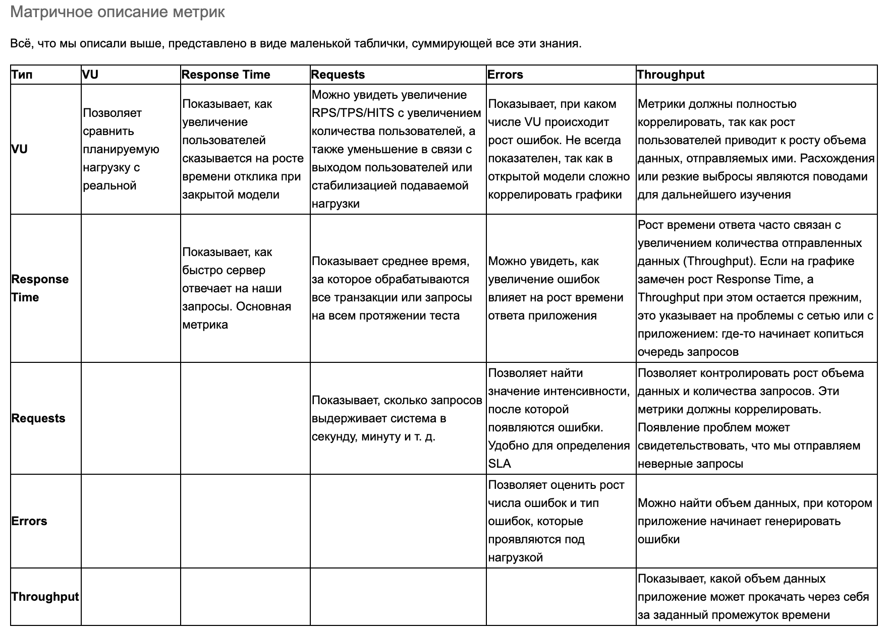

# Заметка по статье от Тинькофф

[Статья](https://habr.com/ru/companies/tbank/articles/514314/)

Самые популярные инструменты для проведения нагрузочного тестирования - Apache JMeter, Gatling, MF LoadRunner

Данная статья является обзором основных видов нагрузочного тестирования и их проведения и отображения в данных инструментах

## График Virtual users

"Простой" подсчет количества активных пользователей.

Тут мы затрагиваем материал домашней работы, а именно, открытую и закрытую модель тестирования. 
При открытой модели количество запросов от пользователей меняется со временем, так как мы имитируем открытую систему, которая доступна извне.
Целью данного тестирования является стресс-тест системы. Что будет в случае непредсказуемых пиковых нагрузок.

При закрытой модели мы имитируем закрытую систему, в которой фиксированное количество пользователей. Проводим нагрузочное тестирование, в ходе которого выясняем,
как система ведет себя в случае долговременной стабильной нагрузки. На лекции сказали что такое тестирование проводится 12+ часов.

В зависимости от выбранного вида тестирования нам важны разные виды графиков числа пользователей. 

При стресс-тестах нужно измерять количество потоков(пользователей) в каждый момент времени

При нагрузочном тестировании нужно выводить сумму всех подключений

## Response time

Время ответа в миллисекундах - время ответа на запросы к приложению

Понятно, что время ответа должно быть постоянно низким, а также увеличиваться при увеличении нагрузки

## Распределение Response time

## Latency

Latency (миллисекунды) — время задержки (чаще всего под этим понимают Network Latency)

Этот параметр показывает время между окончанием отправки запроса до получения первого ответного пакета от системы.

## Bandwidth

## TPS (transactions per second)

## Errors

## HTTP response status

## Throughput

