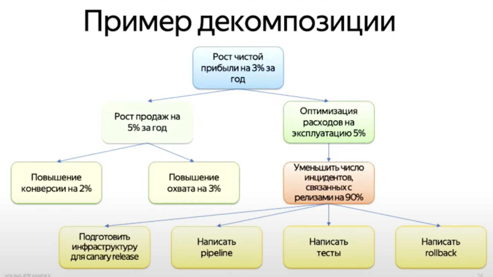
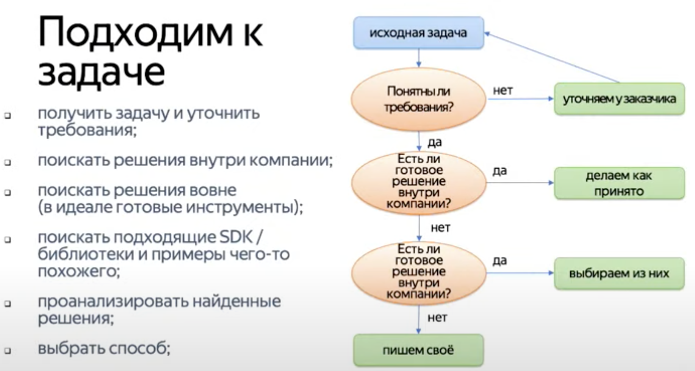
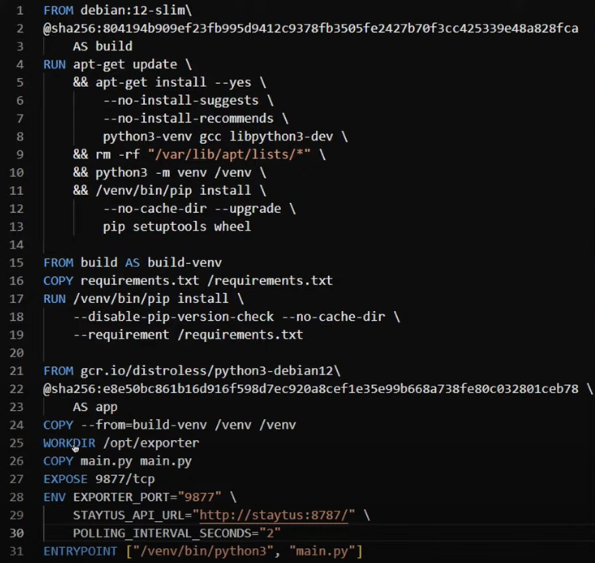
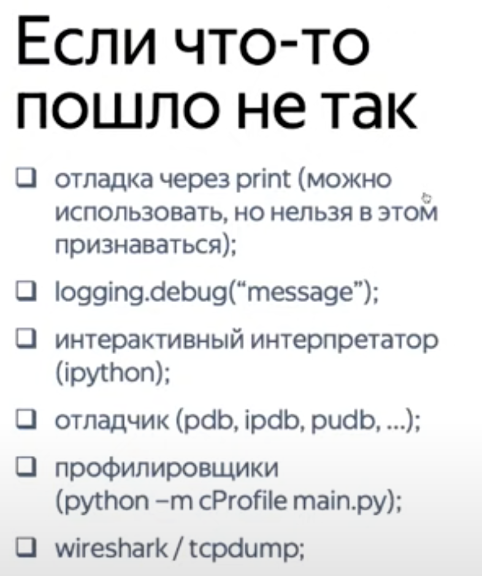

# Прикладное программирование для SRE

[видео](https://www.youtube.com/watch?v=VkLWkBNq6Nw)

## Зачем SRE писать код

## Как подходим к решению задачи

## Разберем на примере

Код примера есть в [репозитории](https://github.com/againDDM/staytus_exporter)

Просто интересный докерфайл. Но 

## Еще немного хороших практик

## Принципы хорошего кода

## Что делать дальше

