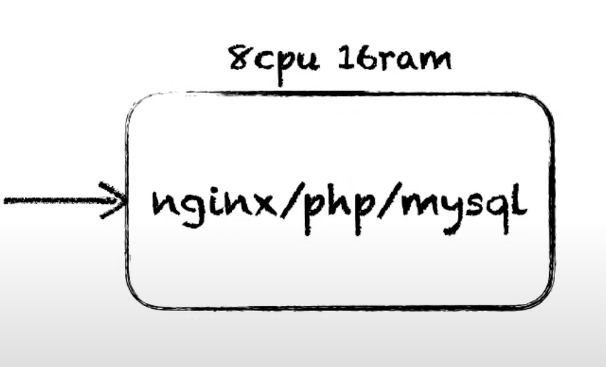
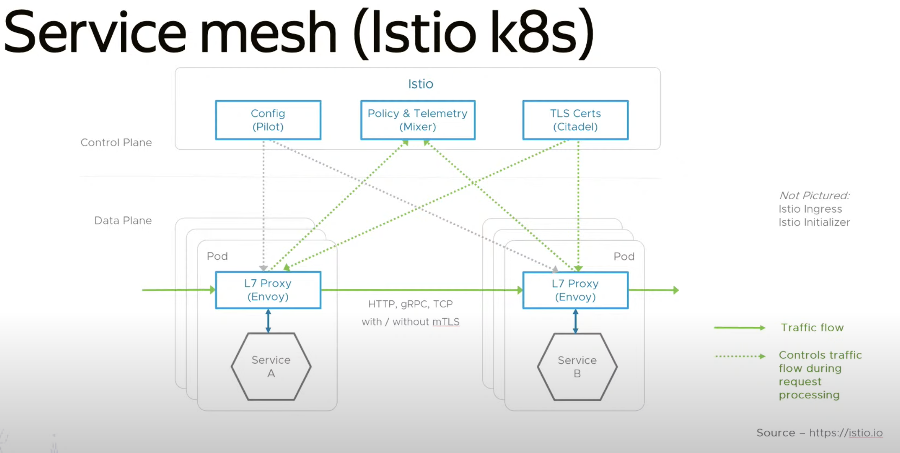
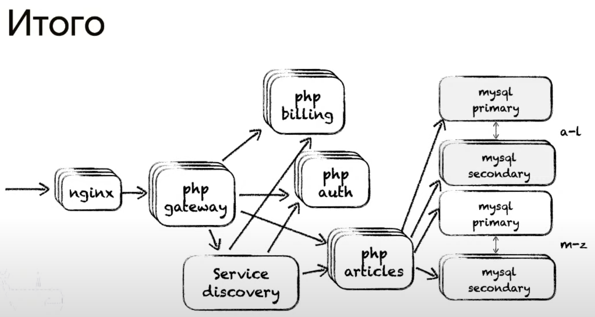
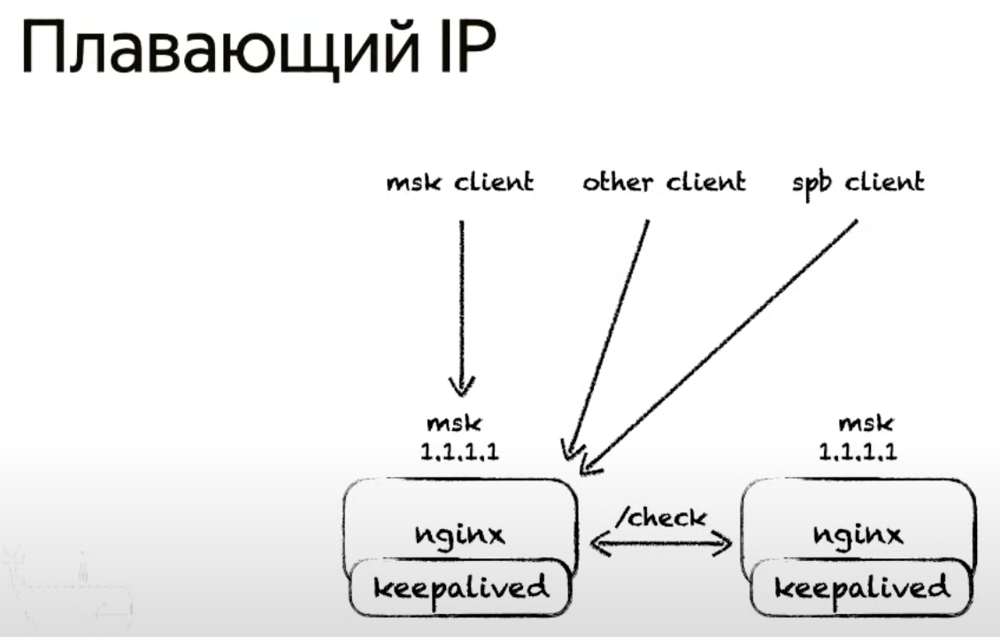
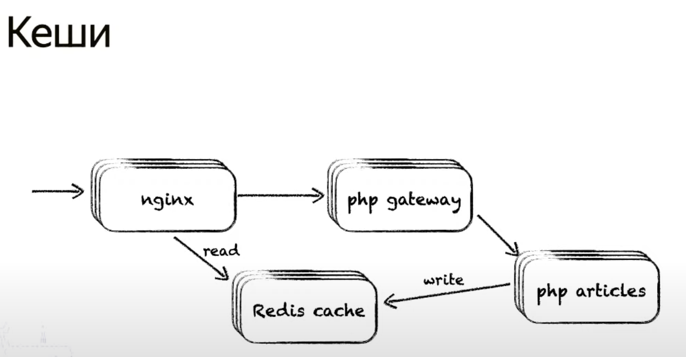
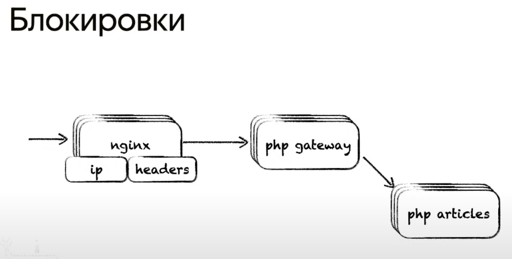
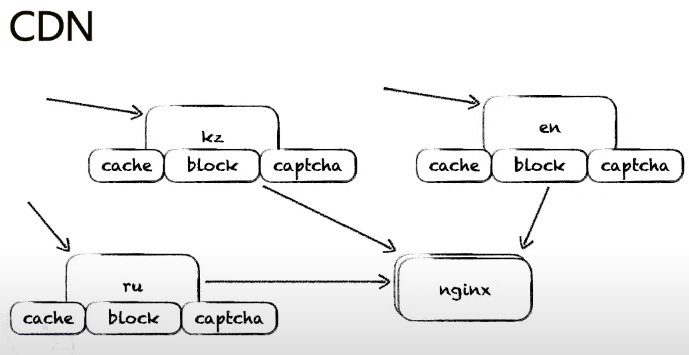

# Архитектура и системный дизайн

## Свойства архитектуры

* масштабируемая - можно менять количество ресурсов с включенным сервисом
    
    Балансировка между приложениями(L7) - на уровне приложения

    - Round robin - отправляем запросы на сервера по порядку

    - взвешенный Round robin - раздаем веса серверам и применяем основной алгоритм

    - Least connection - закидываем запросы на наименее нагруженный сервер. Удобно ввести новый сервер в эксплуатацию

    - Hash - применяем правила по которым распределяем запросы на сервера.

* отказоустойчивая - надежная

* наблюдаемая 

* поддерживаемая

## 1. Масштабируемость

### Требования

- ожидаемый RPS

- количество 9999(uptime/надежность)

- бюджет

- бизнес требования

### stateful/stateless

#### stateful - сервис с сохранением состоянияя

- базы данных

- кэш

#### stateless - сервис без сохранения состояния

- балансировщик нагрузки(nginx)

если у нас много балансировщиков, они сами создают дополнительную нагрузку на сервис. также на балансировку тратится время
можно использовать service discovery, например istio

Итоговая картина, в результате всех оптимизаций

## 2. Отказоустойчивость

Это способность системы переживать разные виды сбоев

### Балансировка на точке входа

- DNS балансировка

DNS сервер просто хранит несколько IP адресов и в ответ на запросы клиентов по алгоритму Round robin раздает их.
Получается такая балансировка нагрузки между серверами

В случае, если один из серверов упал, можно пойти и поменять записи у DNS сервера.
Но мы ничего не сможем сделать, если DNS записи кэшированы у кого-то еще(клиента, его провайдера)

- Geo DNS

Территориально направляем клиентов из разных территорий на разные IP адреса

Проблемы те же, что и у обычного DNS

- BGP

Направление клиента на сервер зависит от таблиц маршрутизации на промежуточных узлах сети

- Плаваюший IP

### Работа со сбоями

- timeout

выставляем стандартные таймауты на запросы к серверу

- retry

количество повторных запросов в случае неудачи нужно стандартизировать

- pumpkin

если отвалился один из микросервисов - вместо его блока показываем пользователю заглушку. Нужно чтобы сайт в целом продолжал работать для клиента
это можно сделать например при помощи nginx

- защита от перегрузок

    - кэш

    

    - капчи

    - блокировки

    

- CDN

### Изоляция контуров

- по окружениям

- по типам устройств

- по geo

## 3. Наблюдаемость

свойство системы, которое показывает текущее состояние системы

- логи

- метрики

- трейсы

- алерты

## 4. Поддерживаемость

свойство системы, позволяющее легко управлять всей системой целиком

