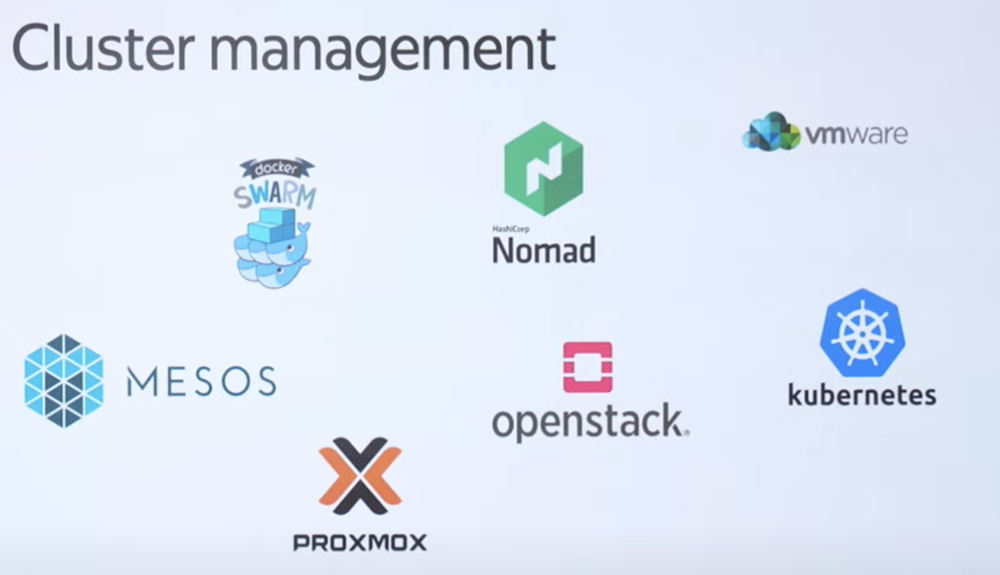
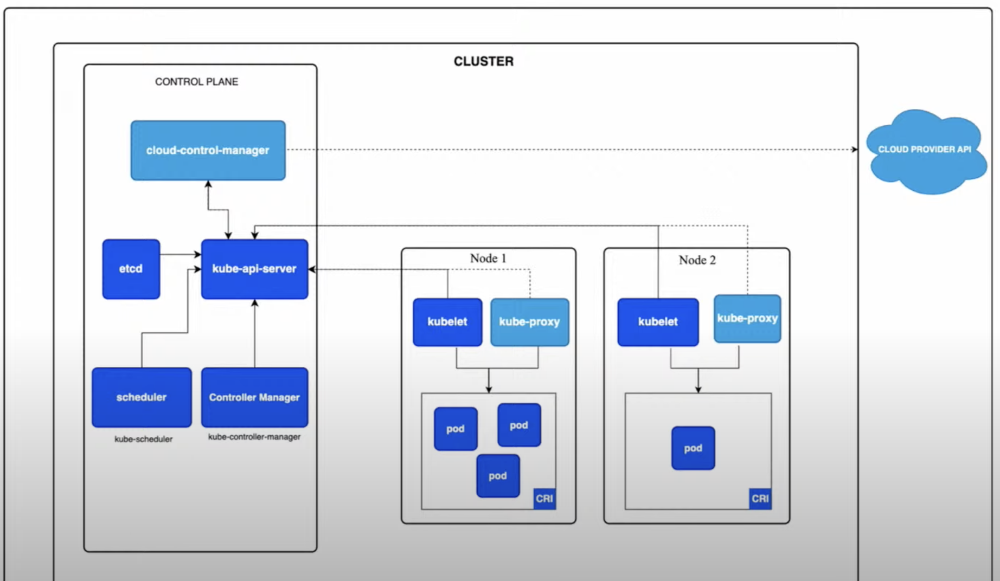

# Управление кластерами

Управление виртуалками:

- VMWare

- ProxMox

- OpenStack

Управление контейнерами:

- docker swarm

- kubernetes

- HashiCorp Nomad

- Mesos

## kubernetes

- pod - абстракция над контейнером

- replicaset - контролирует количество экземпляров подов

- deployment - позволяет управлять стратегией деплоя подов

- service - (service discovery) - позволяет использовать имена вместо адресов конкретных подов, т к поды являются эфемерными, они могут упасть и их IP изменятся

Существуют liveness и readyness probes. Проверки на целостность подов

- kube-proxy - отвечает за балансировку нагрузки между подами, service discovery

