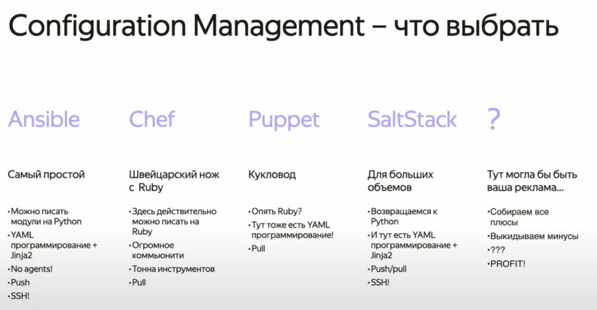
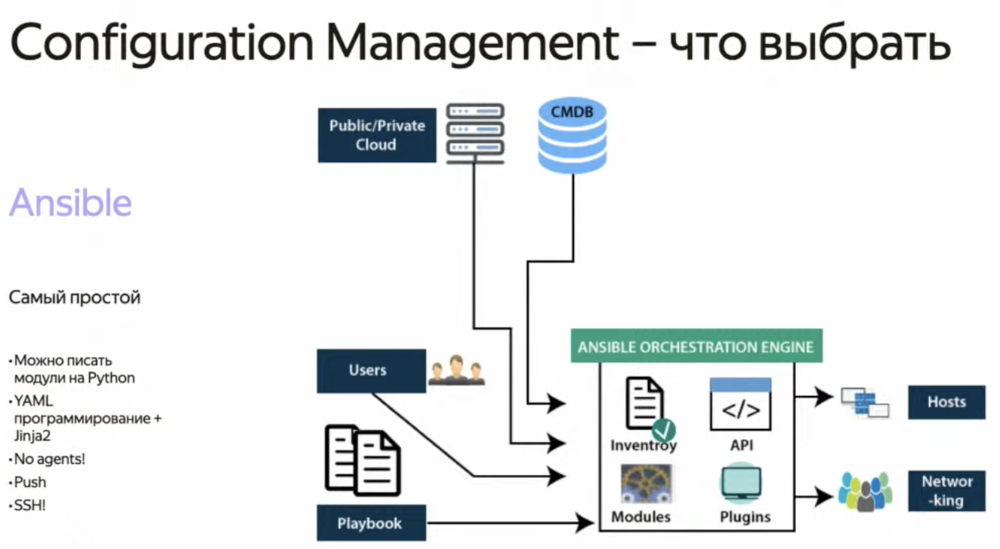
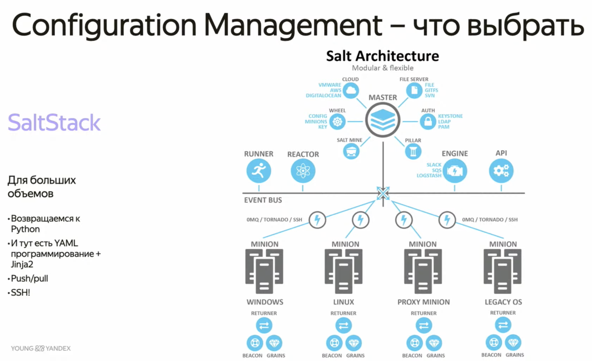

# Лекция "системы управления кластерами и конфигиурациями"




## ansible



Пример конфига ansible

```yaml
- name: set up webserver
  hosts: all
  become: yes
  tasks:
    - name: ensure nginx is at latest version
      apt:
        name: nginx
        state: latest
        update_cache: true
    - name: start nginx
      service:
        name: nginx
        state: started
        enabled: yes
    - name: copy our awesome landing
      copy:
        src: files/index.nginx-debian.html
        dest: /var/www/html/index.nginx-debian.html
        force: true
```


## chef


## puppet


## SaltStack



