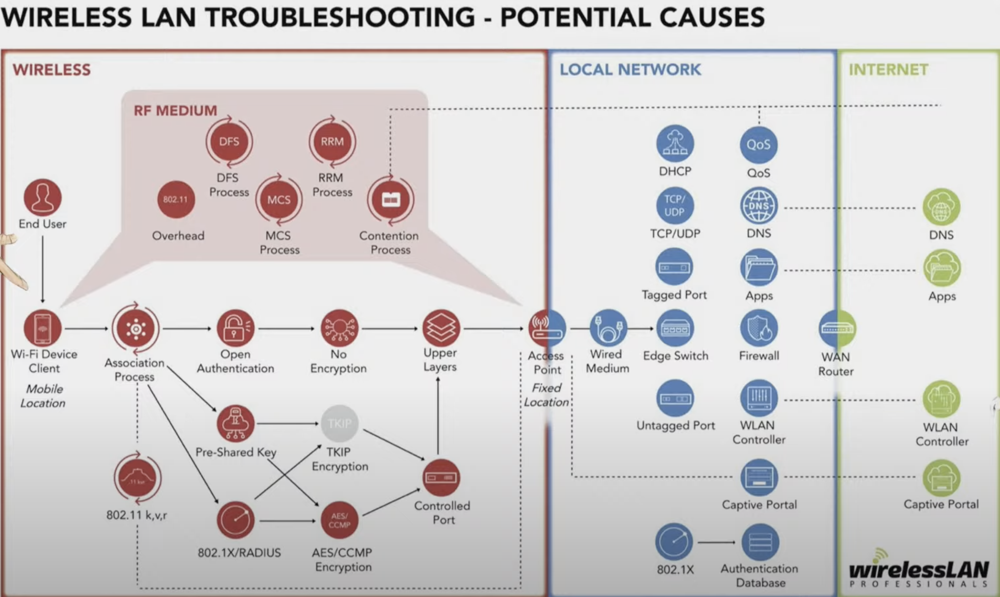
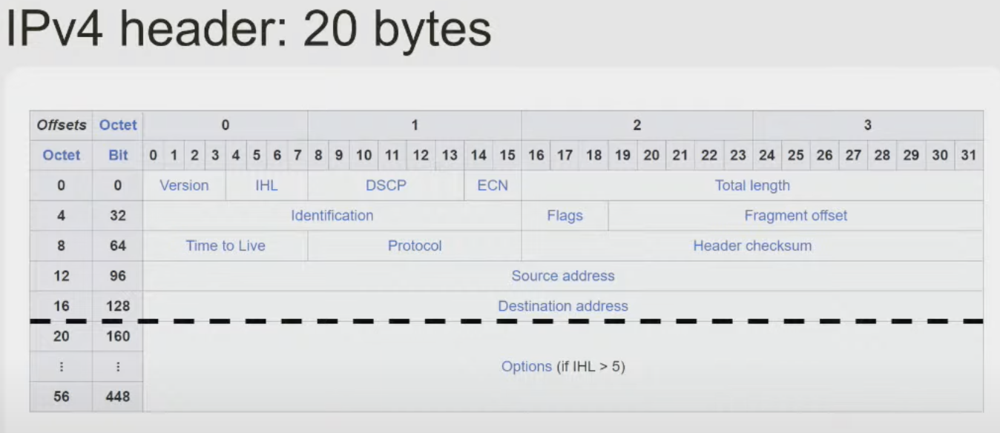
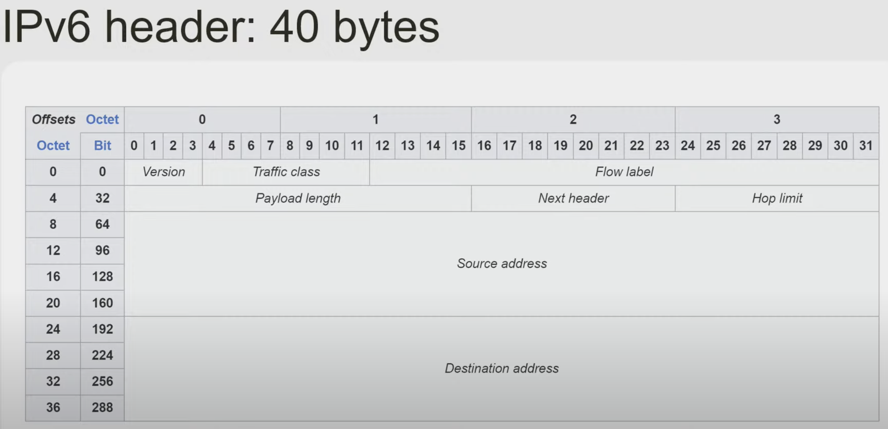
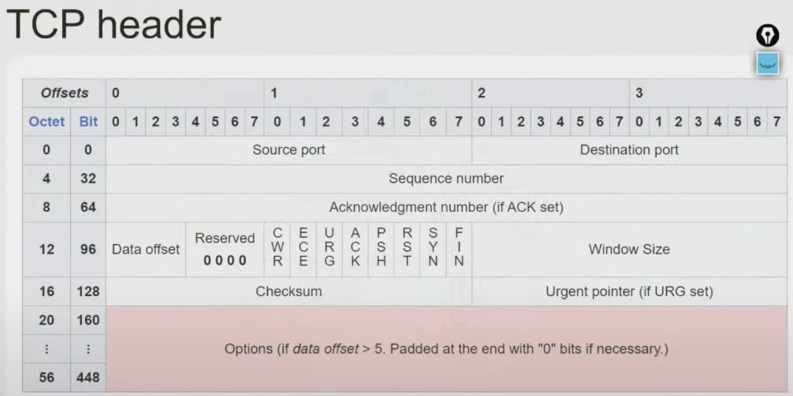
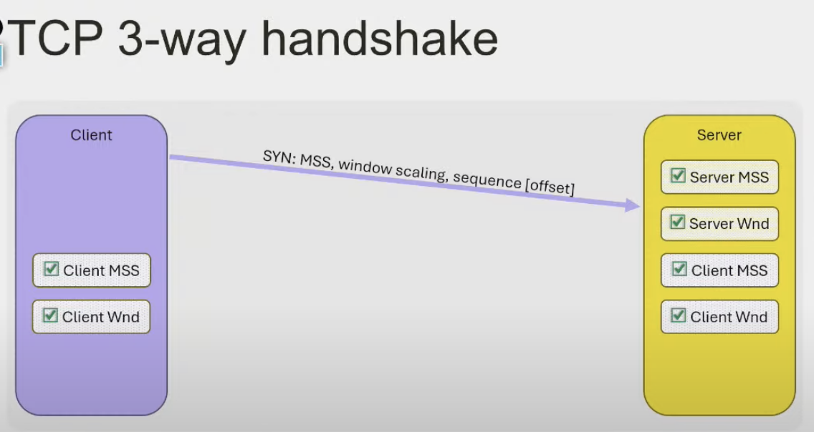
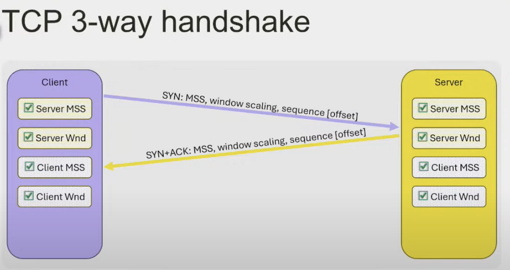
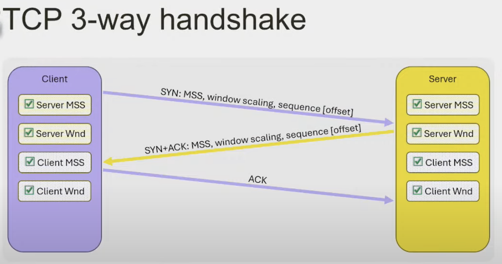
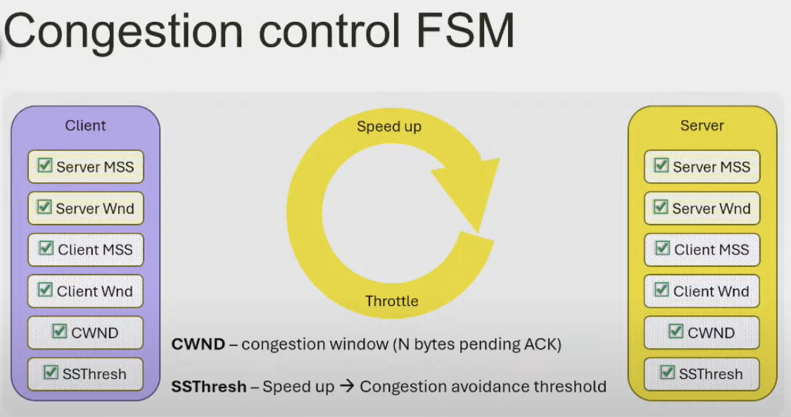

# Как починить интернет

## Как починить интернет

Потенциальные источники проблем, которые надо проверить при "починке"

## Internet protocol

## Routing

Вот так можно посмотреть таблицы маршрутизации

`ip route show table local`

`ip route show table main`

`ip route show table default`

### Policy based routing

`ip rule`

`ip rule help`

Добавляем IP адрес на интерфейс

`'ip addr add <ip address with mask> dev <interface>`

## Sockets

Что такое сокет? Пара IP - port, число, структура, файл?

Существует два вида

### message based sockets

UDP, ICMP протоколы работают поверх таких сокетов

### stream-oriented sockets

TCP

## TCP protocol

придумали в 1974 году

MSS - mx segnment size - максимальный размер сегмента. Определятеся в таблице маршрутзации

MTU

### TCP handshake

Установка сообщения занимает 3 шага

window scaling = число на которое нужно умножить 64кб, чтобы получить реальное значение MSS

sequence(offset) - псеводслучайное число, которое выбирается чтобы начать отсчет номера сегмента. Оно нужно для безопасности, чтобы не стартовать отсчет с 0 и сделать передачу данных безопаснее

### TCP congestion control

КОмпромисс между целостностью передачи данных и скоростью передачи

TCP Reno, Cubic, BBR(google)

## Traffic dumps

### traffic Source

утилиты для генерации трафика, при помощи которых можно имитировать нагрузку

* nc

* curl

* ping / traceroute

* iperf

* scapy

* dig / nslookup

### Observability

Утилиты для анализа трафика

* tcpdump

* wireshark

* ss / ip / ethtool

* strace

