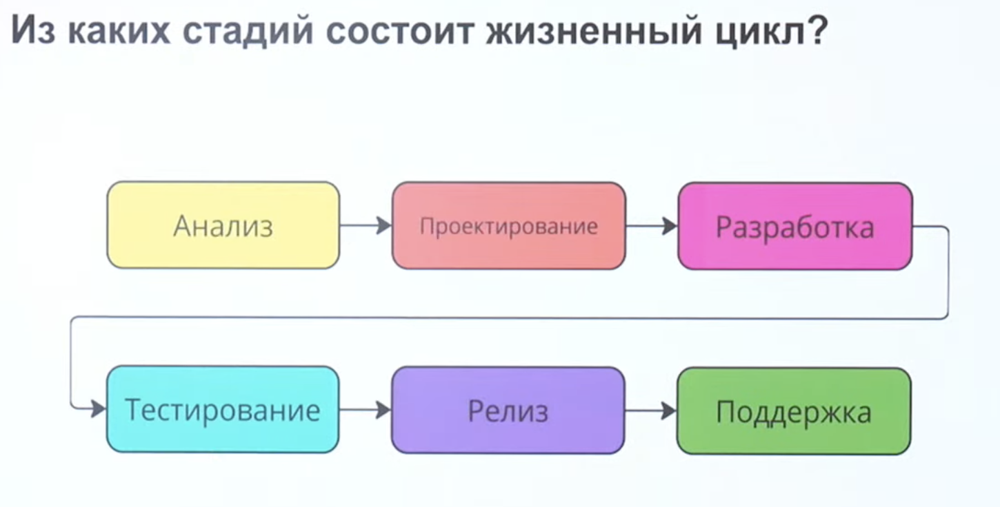
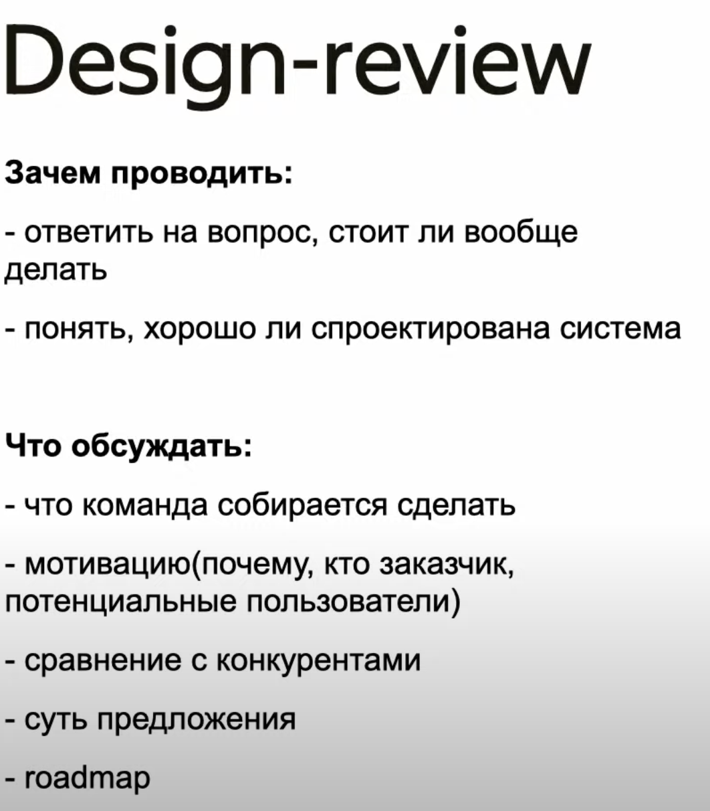
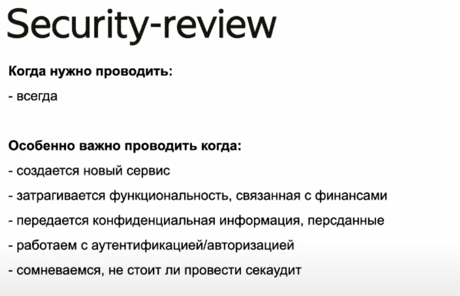
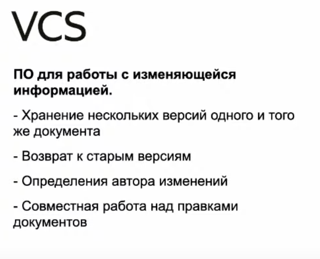
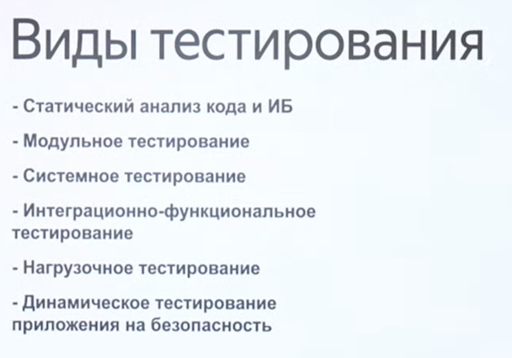
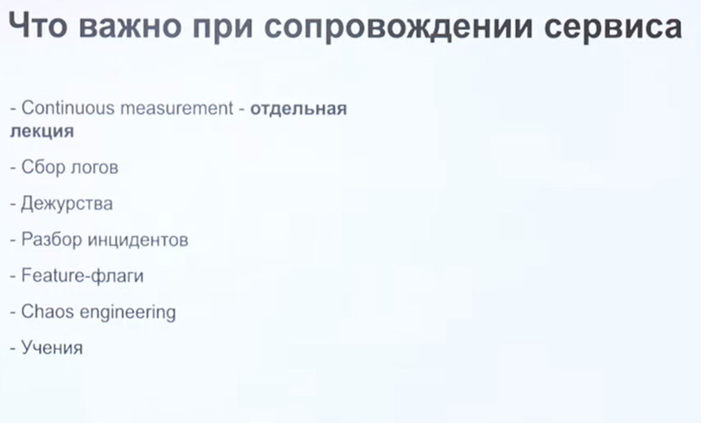

# cycle

## стадии

## Анализ требований и планирование

[IEEE 830-1998](https://ieeexplore.ieee.org/document/720574)

[на русском языке](https://github.com/maxvipon/IEEE-Std-830-1998-RU/blob/master/IEEE%20STD%20830-1998%20(RU).md)

## Проектирование

## Разработка

## Тестрирование

## Релиз

### Существуют разные стратегии релизов:

- канареечный релиз(canary deplyoment)

- Blue-green deploy

- rolling update

- A/B testing

### Feature flags

Настройки, позволяющиие включать и выключать отдельные 

### Релизные окна

Отрезки времени, когда разрешается выкатывать релизы

### Feature freeze

Наоборот - когда выкатывать запрещено. Например, декабрьские пятницы в такси. Или "черные пятницы"

## CI/CD

## Сопровождение

