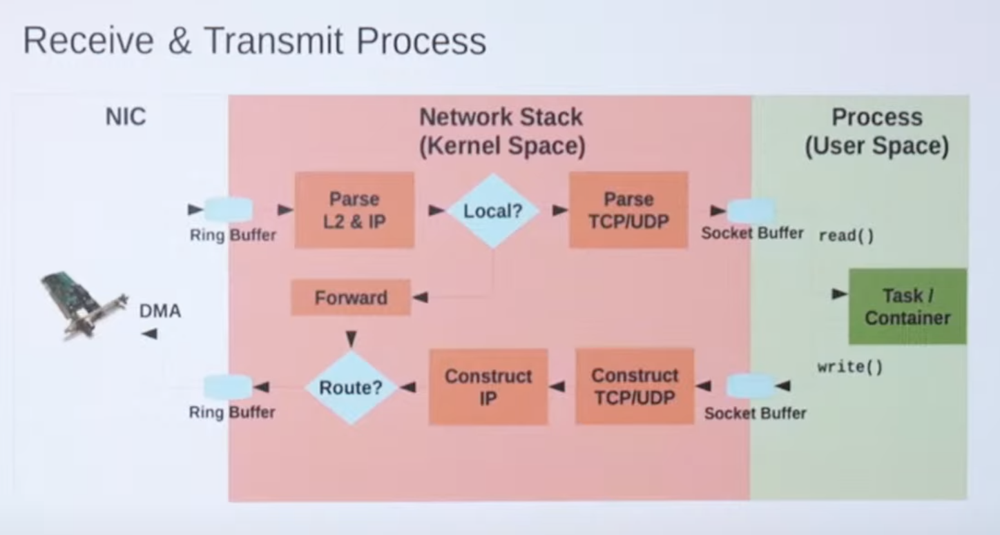

# Сетевой стек Линукс

[видео](https://www.youtube.com/watch?v=EixH3laQWOQ&list=PLXtiZNKIobF45Dkpj0ii6cUIjPLwzUvP8&index=4&pp=iAQB)

В этой лекции мы узнали (или не совсем) каким образом система Линукс обрабатывает сетевые пакеты

Ключевые слова:

- eBPF

- sk_buff

- libvirt

- Кольцевой буффер

- ingress (входщий трафик)

- egress(исходящий трафик)

- проверка Smart checksum при передаче и принятии пакетов
