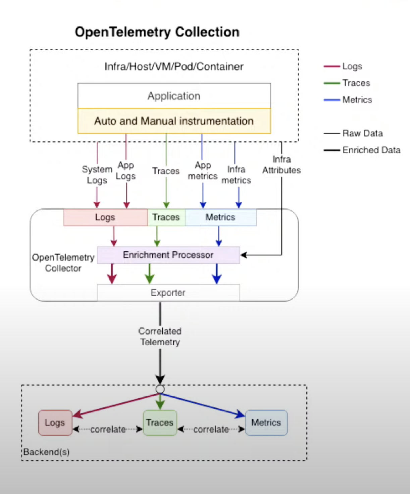

# Наблюдаемость

## Зачем нужна наблюдаемость в ИС

## Столпы наблюдаемости

- метрики

- логи

- трейсы

Есть инструменты, такие как Zipkin, Jaeger. Они требуют внедрить код в приложение и позволяют собирать трейсы

## Пайпалйны доставки

## Визуализация данных

## Построение алертинга и эскалаций
